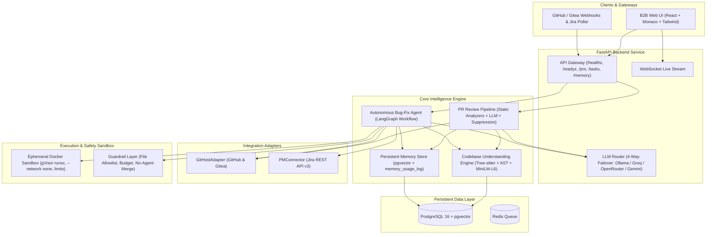

# AI Software Engineering Agent — PR Review & Autonomous Bug-Fixing Platform

An enterprise-grade, multi-tenant AI software engineering agent platform combining automated PR review and autonomous bug-fixing. Powered by a shared codebase understanding engine, persistent memory store with inspectable decision traces, dual git hosting adapters (GitHub + Gitea), bidirectional Jira integration, and an isolated sandbox guarded by strict human-in-the-loop controls.

## User Review Required

> [!IMPORTANT]
> **Phase-by-Phase Execution**: As dictated in `BUILD_PROMPT.md`, we will build and verify the platform phase-by-phase. After each phase, we will stop, present the diffs and test results, and await your confirmation before moving to the next.
> 
> **First Phase**: We will start with **Phase 1: Project Setup & 4-Way Failover LLM Provider Layer**, which is the foundational prerequisite for all reasoning engines across both pipelines.

> [!NOTE]
> **Local Environment**:
> - Python 3.11.1, Node v22.23.1, Git 2.55, Docker 29.7.2 are verified and available.
> - The 4-way failover router supports Ollama (local), Groq, OpenRouter, and Gemini via a unified OpenAI-compatible client interface with dynamic priority, circuit breakers, and automatic failover.

---

## Architectural Blueprint

---

## Delivery Phases & Scope

### Phase 1: Project Setup & 4-Way Failover LLM Provider Layer *(Current Focus)*
- Establish repository layout: `backend/`, `frontend/`, `docker/`, `demo/`.
- Setup `backend` environment with FastAPI, Pydantic v2, structlog, pytest, pytest-asyncio, httpx.
- Implement `LLMProvider` protocol, `OpenAICompatProvider`, and `LLMRouter`:
  - Uniform OpenAI `/chat/completions` client configurable for Ollama, Groq, OpenRouter, and Gemini.
  - Configurable priority via `LLM_PROVIDER_PRIORITY` environment variable.
  - Circuit breaker per provider with exponential backoff / `Retry-After` header adherence.
  - Structured failover logging (`structlog`: `provider_failover`, `from`, `to`, `reason`) and telemetry recording the serving provider on every completion.
- Unit tests: mock 429 rate limit fallthrough, circuit breaker cooldown, exhaustion error, priority reordering.

### Phase 2: Shared Codebase Understanding Engine
- Tree-sitter AST parser for Python, TypeScript, and JavaScript.
- Symbol extraction (classes, methods, functions, imports) and dependency/call-graph extraction using PostgreSQL recursive CTEs.
- Chunk-and-embed pipeline with local `sentence-transformers` (`all-MiniLM-L6-v2`) into `code_chunks` vector table.
- `CodebaseSearchClient`: Unified client for hybrid semantic + lexical + call-graph symbol search.

### Phase 3: Persistent Memory Store & Suppression Engine
- PostgreSQL + pgvector schema:
  - `memory_entries`: `id`, `org_id`, `repo_id`, `kind` (`codebase_fact`, `reviewer_preference`, `task_outcome`, `root_cause`), `summary`, `detail`, `embedding`, `confidence`, `status`, `superseded_by`.
  - `memory_usage_log`: `id`, `memory_entry_id`, `used_in_task_id`, `used_in_step`, `effect`, `created_at`.
- Memory CRUD, cosine similarity vector search, and usage audit trails.
- Deterministic dismissed-pattern suppression engine: Ensures dismissed review comments do not recur on subsequent PRs.

### Phase 4: Git Adapters & Automated PR Review Pipeline
- Unified `GitHostAdapter` protocol:
  - `GitHubAdapter` (GitHub API + PAT / webhook).
  - `GiteaAdapter` (Gitea API, self-hosted container).
- Static analysis runner normalizing outputs from Ruff, Bandit, Semgrep, ESLint into a common `Finding` schema.
- PR review engine:
  - Static findings + LLM reasoning pass via `LLMRouter`.
  - Deterministic suppression filter against `memory_entries`.
  - Inline file/line-anchored comment posting via Git adapter.
  - Accept / Dismiss / Snooze feedback endpoints that update memory.

### Phase 5: Ephemeral Docker Sandbox & Guardrail Layer
- Ephemeral Docker execution container per bug-fix task:
  - Support for `gVisor` (`runsc`) runtime.
  - Network isolation (`--network none`).
  - Strict resource caps: CPU, memory, PIDs, timeout limits, max files touched.
  - Auto-cleanup of container and volumes regardless of task success/failure.
- Guardrail layer:
  - File allowlist enforcement.
  - Bounded iteration budget.
  - **No-Agent-Merge**: Merge operation is strictly absent from the agent's toolset; only a human in the UI can merge.
  - Adversarial test suite attempting unauthorized tool executions and merge bypasses.

### Phase 6: Autonomous Bug-Fix Agent (LangGraph Workflow)
- LangGraph state machine:
  1. **Intake**: Parse bug report or Jira ticket.
  2. **Memory Lookup**: Query `memory_entries` for prior root causes or codebase patterns.
  3. **Reproduce**: Execute/synthesize a reproduction test in the sandbox.
  4. **Explore**: Search codebase via `CodebaseSearchClient`.
  5. **Edit**: Modify code to resolve root cause.
  6. **Test**: Run test suite in sandbox; iterate up to bounded budget.
  7. **Create PR**: Open draft PR via `GitHostAdapter` with comprehensive description and root cause summary.
  8. **Update PM**: Post progress and link PR back to Jira ticket.
  9. **Await Human Gate**: Block until human explicitly reviews diff and clicks "Approve & Merge".
- WebSocket streaming of agent turns, thoughts, and sandbox execution logs.

### Phase 7: PM Tool Integration (Jira Connector)
- `PMConnector` protocol with `JiraConnector`:
  - Polling REST API v3 for issues with target labels/statuses.
  - Bidirectional status updates: "In Progress", work notes, and PR URL linking.

### Phase 8: B2B Web Dashboard UI
- Modern React + TypeScript + Vite + Tailwind + shadcn/ui frontend:
  - **PR Review View**: Monaco-based diff viewer with inline findings, severity badges, and Accept/Dismiss/Snooze actions.
  - **Bug-Fix Task View**: Live WebSocket terminal stream, step progress, test outputs, and human "Approve & Merge" button.
  - **Memory & Insights View**: Inspectable cards of accumulated codebase facts, reviewer preferences, and root causes, with an audit log showing why each memory was used.
  - **Connections Settings**: Org credentials for GitHub, Gitea, Jira, and LLM provider priority/keys.
  - **Trends & Analytics**: Metric charts for review velocity, suppression rates, and fix success rates using Recharts.

### Phase 9: Before/After Memory Demonstration Script
- `demo/run_memory_demo.py`:
  - Run 1 (Cold): Executes task without memory -> records steps taken, findings produced, or time to fix.
  - User feedback or fix resolution stored in `memory_entries`.
  - Run 2 (Warm): Executes related task with memory active -> verifies suppressed finding or reused root cause.
  - Saves a verifiable before/after delta report artifact (`demo/memory_delta_results.json` and `.md`).

### Phase 10: Docker Compose, Healthchecks & Production Readiness
- Complete `docker-compose.yml`: `postgres`, `redis`, `gitea`, `ollama`, `api`, `worker`, `frontend`.
- `/healthz` and `/readyz` endpoints checking Postgres, Redis, and LLM router connectivity.
- Multi-tenant data model with `org_id` isolation.
- Structured stdout logging via `structlog`.
- `README.md`, `ARCHITECTURE.md`, and OpenAPI specs.

---

## Proposed Changes for Phase 1

### Backend Core & LLM Router

#### [NEW] [backend/pyproject.toml](file:///c:/Users/Siddharth.Savant/Documents/AI%20Software%20Engineering%20Agent/backend/pyproject.toml)
Python project dependencies: `fastapi`, `uvicorn`, `pydantic`, `pydantic-settings`, `httpx`, `structlog`, `pytest`, `pytest-asyncio`.

#### [NEW] [backend/app/core/config.py](file:///c:/Users/Siddharth.Savant/Documents/AI%20Software%20Engineering%20Agent/backend/app/core/config.py)
12-factor configuration with environment variables, provider keys, base URLs, and priority settings.

#### [NEW] [backend/app/core/logging.py](file:///c:/Users/Siddharth.Savant/Documents/AI%20Software%20Engineering%20Agent/backend/app/core/logging.py)
Structured logging using `structlog` outputting JSON to stdout.

#### [NEW] [backend/app/llm/protocol.py](file:///c:/Users/Siddharth.Savant/Documents/AI%20Software%20Engineering%20Agent/backend/app/llm/protocol.py)
`LLMProvider` protocol, `LLMResponse`, `ChatMessage`, and exception classes (`RateLimitError`, `ProviderUnavailableError`, `AllProvidersExhaustedError`).

#### [NEW] [backend/app/llm/openai_compat.py](file:///c:/Users/Siddharth.Savant/Documents/AI%20Software%20Engineering%20Agent/backend/app/llm/openai_compat.py)
Unified `OpenAICompatProvider` handling Ollama, Groq, OpenRouter, and Gemini with timeout, header formatting, and standardized response parsing.

#### [NEW] [backend/app/llm/router.py](file:///c:/Users/Siddharth.Savant/Documents/AI%20Software%20Engineering%20Agent/backend/app/llm/router.py)
`LLMRouter` with dynamic priority ordering, per-provider circuit breaker state, cooldown tracking, failover logging, and serving-provider telemetry.

#### [NEW] [backend/tests/test_llm_router.py](file:///c:/Users/Siddharth.Savant/Documents/AI%20Software%20Engineering%20Agent/backend/tests/test_llm_router.py)
Unit tests for the router:
1. Normal completion from highest priority provider.
2. 429 rate limit fallthrough to secondary provider.
3. Circuit breaker skips cooling provider on subsequent calls.
4. Cooldown expiration restores provider.
5. All providers exhausted raises `AllProvidersExhaustedError`.
6. Dynamic reordering via configuration.

#### [NEW] [.env.example](file:///c:/Users/Siddharth.Savant/Documents/AI%20Software%20Engineering%20Agent/.env.example)
Clean 12-factor environment variable template with placeholders for all providers and services.

---

## Verification Plan

### Automated Tests
- Run `pytest backend/tests/test_llm_router.py -v` using the local Python 3.11 environment.
- Verify 100% pass rate across normal completions, mock rate limits, circuit breaker trips, and exhaustion scenarios.

### Manual Verification
- Test configuration loading from environment variables.
- Verify structured log output formatting in terminal.
